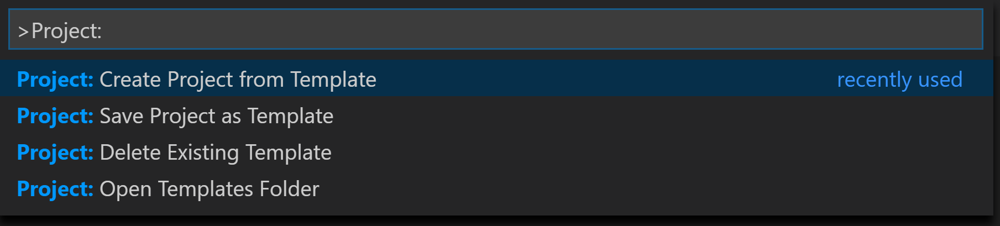
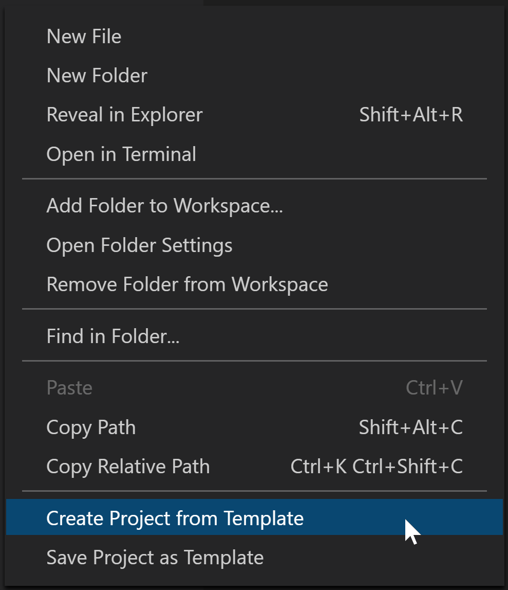

# Template de desenvolvimento
Template para facilitar na criação de novos servisos

## Requisitos
- vscode
- Project Templates (extenção)

### 1. Configurando pasta
- Adicione a pata **"FlaskApi"** localizada em **/template** no seguinte diretorio:
    ```
    $HOME/.config/Code/User/ProjectTemplates                       # Linux
    $HOME/Library/Application Support/Code/User/ProjectTemplates   # macOS
    %APPDATA%\Roaming\Code\User\ProjectTemplates                   # Windows
    ```

### 2 Usando
Os comandos de extensão podem ser executados na Paleta de Comandos ou no menu de contexto ao selecionar uma pasta.



